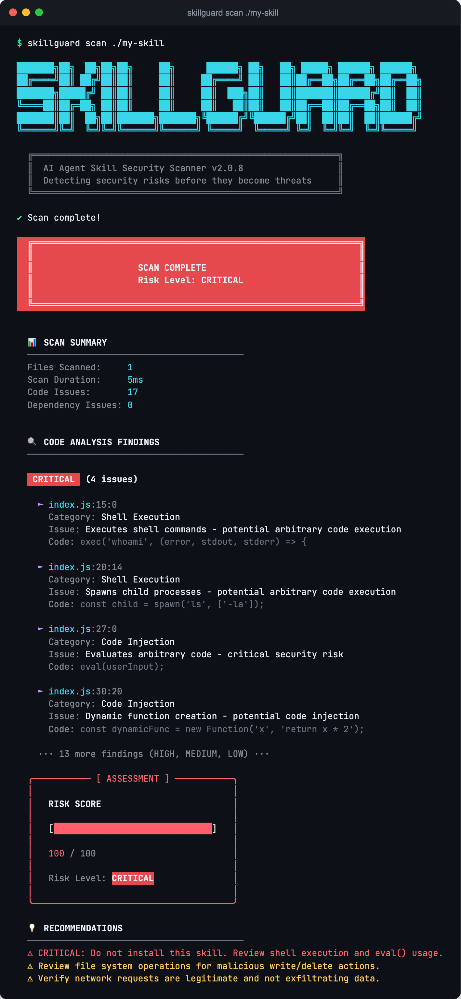

<div align="center">

# 🛡️ SkillGuard

**Scan an AI agent skill before you let it run on your machine.**

[](https://github.com/heyytars/skillguard/actions)
[](https://github.com/heyytars/skillguard/releases/latest)
[](LICENSE)

```bash
brew install heyytars/tap/skillguard
skillguard scan ./some-skill
```



</div>

---

## Why this exists

Agents like Claude Code and Codex can now install "skills": small bundles of code that run with your permissions. Your files, your shell, your API keys, your network.

Most people install them the way they install browser extensions. Read the description, click install, hope for the best.

SkillGuard is the five-second check you do first. It reads the code, checks what it depends on, and tells you plainly: **safe, review it, or don't install it.**

## How it works


1. **You point it at a folder.** Nothing gets run or installed. It only reads.
2. **It reads the code.** 305 built-in rules across 10 languages look for things a skill shouldn't be doing quietly.
3. **It checks the dependencies.** Known-bad and look-alike packages (`lodahs` posing as `lodash`), plus live lookups in npm audit and the [OSV](https://osv.dev) vulnerability database.
4. **You get a verdict.** A score from 0 to 100, every finding with its file and line, and an exit code your CI can act on.

## What it catches

| | Risk | What that looks like |
|---|---|---|
| 🐚 | **Runs shell commands** | `exec()`, `os.system()`, `Runtime.exec()`, `Command::new()` |
| 💉 | **Runs injected code** | `eval()`, `new Function()`, `pickle.loads()`, JNDI lookups (the Log4Shell trick) |
| 🔑 | **Steals keys and secrets** | Hardcoded secrets, reading `~/.ssh`, keychains, AWS credentials |
| 📤 | **Sends your data out** | Network calls, DNS tricks, clipboard reads, screenshots, keyboard hooks |
| 🎭 | **Hides from analysis** | Debugger detection, sandbox checks, base64 + eval, obfuscation |
| 🤖 | **Tampers with LLM prompts** | Building system prompts or calling OpenAI, Anthropic or LangChain with untrusted input |
| 🗂️ | **Touches your files** | Writing, deleting, or changing permissions on files |
| 📦 | **Pulls in bad packages** | Known malicious names, typosquats, packages with published CVEs |

### Languages

| Language | Rules | How it reads the code |
|---|---:|---|
| JavaScript / TypeScript | 40 | Parses the code into a syntax tree, so it understands structure, not just text |
| Python | 45 | Pattern matching |
| PHP | 44 | Pattern matching |
| Ruby | 38 | Pattern matching |
| Java | 37 | Pattern matching |
| C / C++ | 37 | Pattern matching |
| Go | 33 | Pattern matching |
| Rust | 31 | Pattern matching |

## Install

**Homebrew** (macOS and Linux)

```bash
brew install heyytars/tap/skillguard
```

**GitHub Releases** (anywhere with Node.js 20.19 or newer)

```bash
npm install -g https://github.com/heyytars/skillguard/releases/latest/download/skillguard.tgz
```

**Run once without installing**

```bash
npx -y https://github.com/heyytars/skillguard/releases/latest/download/skillguard.tgz scan ./some-skill
```

> SkillGuard isn't on the npm registry. It ships through Homebrew and GitHub Releases only, so any `skillguard` package you find on npm isn't this project.

<details>
<summary>Build from source</summary>

```bash
git clone https://github.com/heyytars/skillguard.git
cd skillguard
npm install
npm run build
npm link
```

</details>

## Use it

```bash
skillguard scan ./some-skill                    # full report
skillguard scan ./some-skill --quiet            # skip the logo
skillguard scan ./some-skill --json             # machine-readable, for scripts and CI
skillguard scan ./some-skill --config strict.json
```

Want to see it catch something? `examples/` has a deliberately malicious skill, a safe one, and samples in every language:

```bash
skillguard scan ./examples
```

### Reading the score

Each finding adds points based on how dangerous it is. The total is capped at 100.

| Score | Verdict | What to do |
|---|---|---|
| 0 | ✅ Safe | Good to install |
| 1 to 20 | 🔵 Low | Skim the findings |
| 21 to 50 | 🟡 Medium | Review carefully |
| 51 to 75 | 🟠 High | Don't install without a proper review |
| 76 to 100 | 🔴 Critical | Don't install |

<details>
<summary>How the points add up</summary>

Every code finding adds the higher of two numbers: its **category weight** or its **severity weight**. Dependency findings add their severity weight.

| Category | Points |
|---|---:|
| Shell execution, code injection, buffer overflow, JNDI injection | 50 |
| Prompt injection, credential theft | 45 |
| Data exfiltration, evasion, unsafe code | 40 |
| File write or delete, deserialization, reflection | 30 |
| File permissions, SQL operations | 25 |
| Network access | 20 |
| Environment variable access | 10 |

| Severity | Points |
|---|---:|
| Critical | 50 |
| High | 30 |
| Medium | 20 |
| Low | 10 |

So one `eval()` on its own puts a skill at 50 (Medium). Add one `exec()` and it's at 100 (Critical).

</details>

## Make it yours

Drop a `.skillguardrc.json` next to the skill (or in any folder above it) and SkillGuard picks it up. You only write what you want to change; everything else keeps its default.

```json
{
  "riskThresholds": { "critical": 90 },
  "globalPatternOverrides": [
    { "pattern": "fetch", "severity": "low", "description": "This skill is supposed to call APIs" }
  ]
}
```

Ready-made presets:

- [`examples/configs/strict.json`](examples/configs/strict.json): for production and shared machines
- [`examples/configs/permissive.json`](examples/configs/permissive.json): for local experiments
- [`examples/configs/network-focused.json`](examples/configs/network-focused.json): when data leaving the machine is your main worry
- [`.skillguardrc.example.json`](.skillguardrc.example.json): every option, documented

📖 Full guide: [CONFIGURATION.md](CONFIGURATION.md)

## Put it in CI

SkillGuard exits with code `1` when the verdict is **High** or **Critical**, so a risky skill fails the build with no extra scripting.

```yaml
- name: Scan skill
  run: |
    npx -y https://github.com/heyytars/skillguard/releases/latest/download/skillguard.tgz \
      scan ./skills/my-skill --json > skillguard.json
```

The JSON has `riskScore`, `riskLevel`, `codeFindings`, `dependencyFindings`, `scannedFiles` and `scanDuration`.

## What it doesn't do

Worth knowing before you trust any scanner:

- **It reads code, not instructions.** A skill can do harm through what its `SKILL.md` or prompt files tell the agent to do. SkillGuard doesn't read those yet.
- **Outside JS/TS it matches patterns.** That's fast and catches the common moves, but someone determined can disguise code to slip past pattern rules.
- **CVE lookups cover npm packages only.** Python, Go, Rust and Ruby dependency files aren't checked against vulnerability databases yet.
- **It flags capabilities, not guilt.** A skill that calls `fetch()` might be doing exactly what it says. Findings tell you where to look.

Use it as the first look, not the only one.

## Under the hood

```
src/
├── index.ts             CLI entry
├── scanner.ts           walks the folder and runs everything
├── analyzers/           one file per language (JS/TS builds a syntax tree; the rest match patterns)
├── dependencies.ts      known-bad and look-alike packages
├── vulnerabilities.ts   npm audit + OSV lookups (in a temp copy, never inside your folder)
├── scorer.ts            turns findings into a 0 to 100 score
├── config.ts            loads .skillguardrc.json
└── ui.ts                the terminal report
```

```bash
npm install
npm test                    # jest
npm run lint
npm run dev scan ./examples
```

Releasing is one command, `scripts/release.sh`. See [PUBLISHING.md](PUBLISHING.md). What changed and when: [CHANGELOG.md](CHANGELOG.md).

## Roadmap

- [ ] Read `SKILL.md` and prompt files for harmful instructions
- [ ] CVE checks for Python, Go, Rust and Ruby dependencies
- [ ] A ready-made GitHub Action
- [ ] Syntax-tree analysis for Python

Want one of these sooner? [Open an issue](https://github.com/heyytars/skillguard/issues/new).

## Contributing

New rules, new languages, fewer false alarms, clearer docs: all welcome. Start with [CONTRIBUTING.md](CONTRIBUTING.md) and the [Code of Conduct](CODE_OF_CONDUCT.md).

Found a bug? [Open an issue](https://github.com/heyytars/skillguard/issues).

## License

MIT. See [LICENSE](LICENSE).
